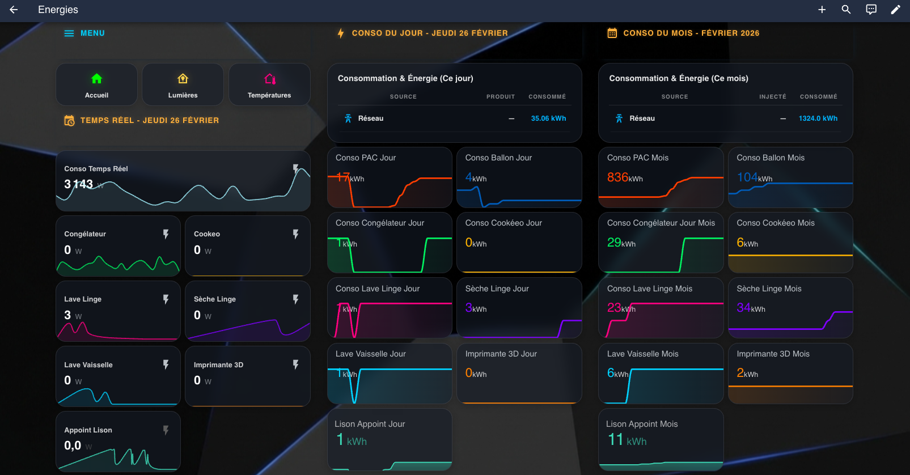
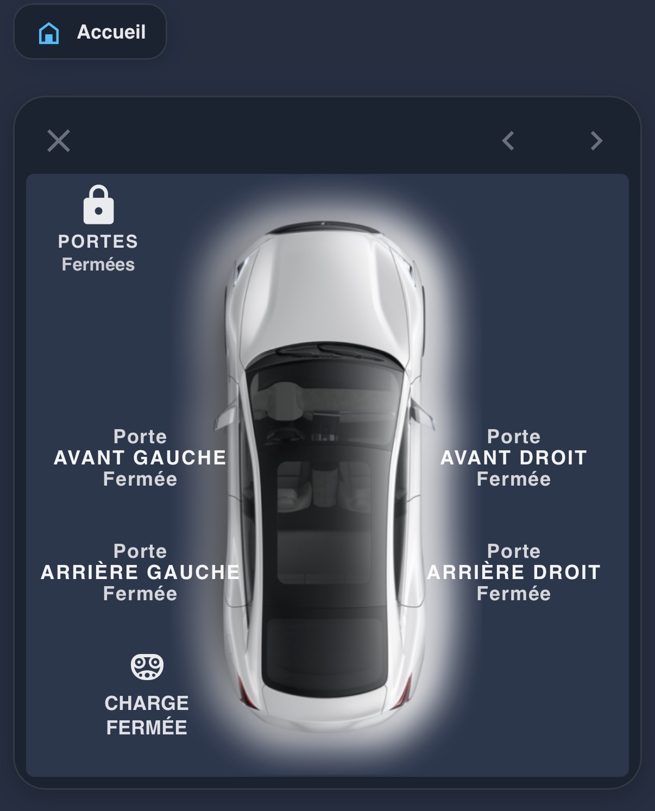
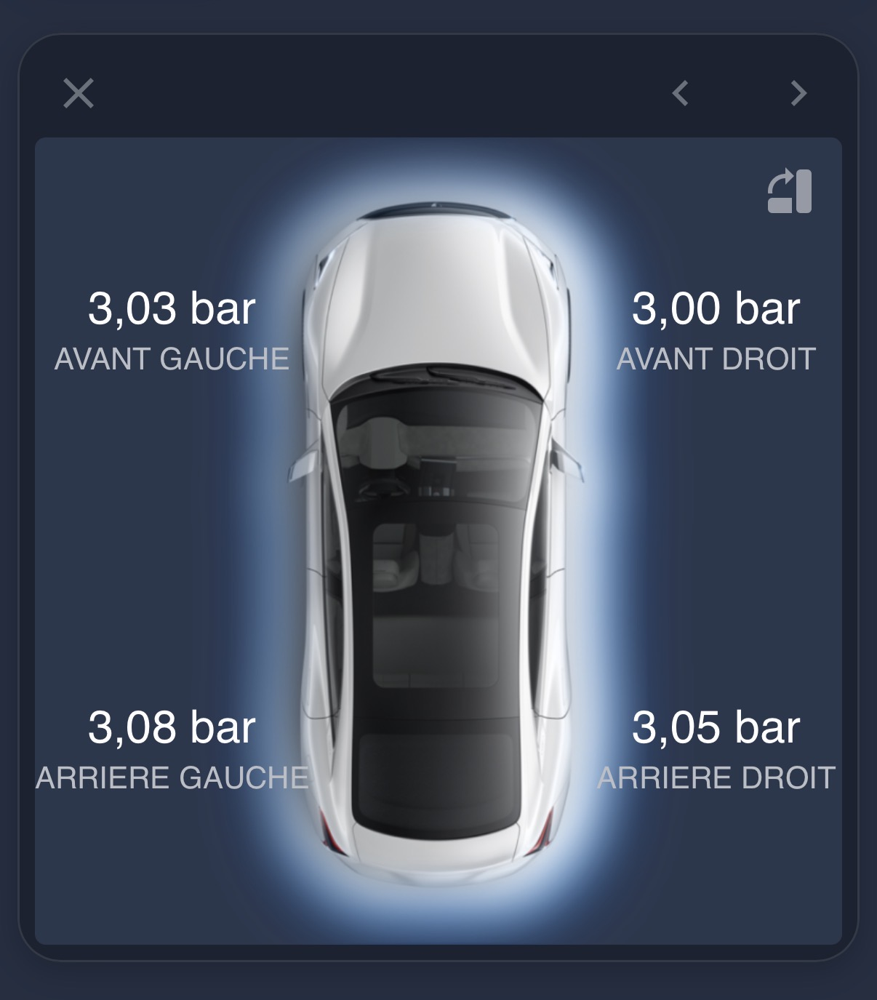
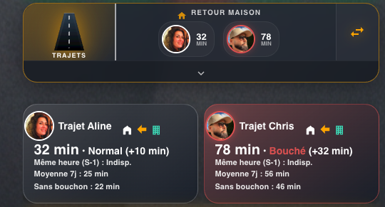
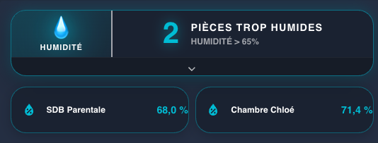
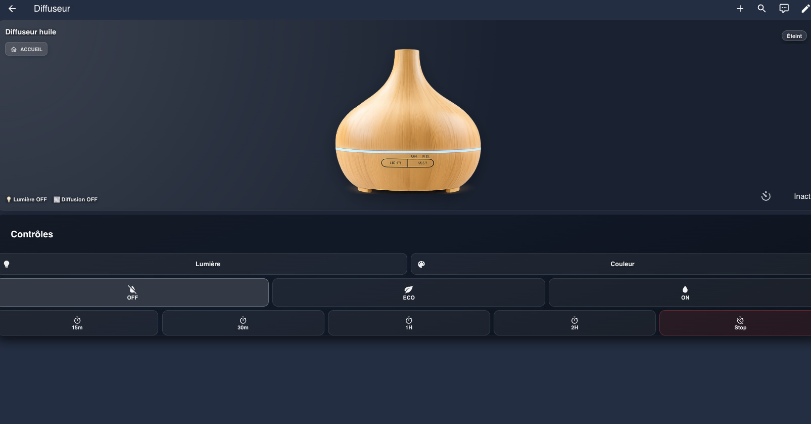
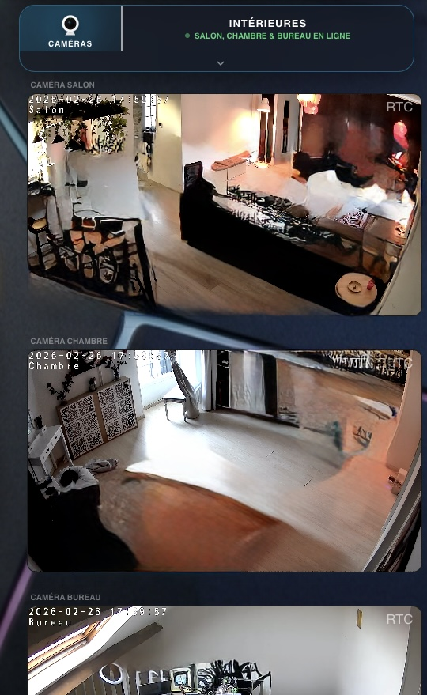
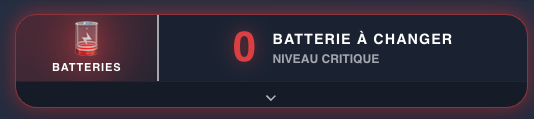

# 🏠 Home Assistant - Premium Glassmorphism Dashboard

A state-of-the-art Home Assistant dashboard featuring a deep, immersive glassmorphism design, advanced Lovelace cards, and complex smart home logic.

> [!NOTE]
> This GitHub repository and the associated dashboard were designed and refined with the help of **Antigravity** and **Gemini**.

---

## 📸 Interactive Dashboard Gallery

### 📱 Main Overviews
*The dashboard is designed for high-end tablet and desktop usage with a premium glassmorphic feel.*

| Main Control Center | Lighting Control Dashboard |
|:---:|:---:|
|  |  |
| Core interface with quick access to all home subsystems. | Dedicated section for granular control of all home lighting. |

| Temperature Monitoring | Energy Consumption |
|:---:|:---:|
|  |  |
| Real-time temperature grid with HSL-tailored indicators. | Detailed power usage and solar/grid statistics. |

| Entertainment & Apple TV | Network & Infrastructure | NAS Monitoring |
|:---:|:---:|:---:|
|  |  |  |
| Integrated remote and media management. | Livebox/Router status and network vitals. | Synology/NAS health and storage metrics. |

---

### 🚗 Smart Mobility - Tesla Model 3
*Deep integration providing real-time data and remote controls.*

| Summary (Closed) | Detailed Controls (Expanded) |
|:---:|:---:|
|  |  |
| Displays range, charge level, and lock status. | **Expanded View**: Direct control for doors, trunk, frunk, and windows. |

| Climate Management | Navigation & Map | Tire Pressure |
|:---:|:---:|:---:|
|  |  |  |
| Full HVAC control and seat heating. | Real-time vehicle location and navigation status. | Granular PSI/Bar readings for each tire. |

---

### 🌡️ Climate & Environment
*Advanced management of home comfort systems.*

| **PAC & Hot Water** (Closed) | **PAC & Hot Water** (Expanded) |
|:---:|:---:|
|  |  |
| Shows current temperature and heating status of the heat pump. | **Expanded View**: Detailed energy consumption graphs, heating power, and Hot Water (ECS) management with target temperatures. |

| **Weather** (Closed) | **Weather** (Expanded) | **Humidity** (Expanded) |
|:---:|:---:|:---:|
|  |  |  |
| Current weather conditions and temp. | **Expanded**: 7-day detailed forecast. | **Expanded**: Historical humidity graphs per room. |

| **Smart Diffuser** (Closed) | **Smart Diffuser** (Expanded) |
|:---:|:---:|
|  |  |
| Current status of the diffuser. | **Expanded View**: Dynamic "smoke" animation and light control when active, plus integrated timer setting. |

---

### 🚗 Trajets Travail & Domicile
*Suivi en temps réel des temps de trajet pour les membres de la famille.*

| Résumé (Fermé) | Détails du Trafic (Ouvert) |
|:---:|:---:|
|  |  |
| Aperçu rapide des temps de trajet actuels vers le domicile ou le travail. | **Vue Étendue** : Détails par utilisateur, état du trafic (Fluide/Bouché), et comparaison avec le temps habituel. |

| Lighting Overview | Lighting Controls |
|:---:|:---:|
|  |  |
| Summary of active lights in each zone. | Granular brightness and color controls. |

| External Surveillance | Internal Security |
|:---:|:---:|
|  |  |
| High-res thumbnail grid of external perimeters. | Real-time internal feeds and motion history. |

| Imprimante Multifonction (Brother) | Laundry Lifecycle | Smart Calendar |
|:---:|:---:|:---:|
|  |  |  |
| État des toners, tambours et unités de maintenance. | Complex status tracking for Washing/Dryer. | Scrollable agenda view of upcoming events. |

| Battery Levels | Waste Collection | Packages (17TRACK) |
|:---:|:---:|:---:|
|  |  |  |
| Monitoring all wireless device batteries. | Trash type and pickup day reminders. | Real-time tracking of pending deliveries. |

---

### 🏥 Health & Medical
*Specialized follow-up and notification logic.*

| Post-Op Tracker | Medical Detail |
|:---:|:---:|
|  |  |
| Daily health checklist and reminders. | Specific medical protocol follow-up (e.g., hair transplant). |

---

## 🛠️ Technical Guide & Implementation

This repository follows a modular structure where UI cards are deeply linked to back-end logic.

### 🔗 Understanding the Dependencies

To fully replicate this dashboard, you must understand how the components interact:

1.  **UI Layout (`ui-lovelace.yaml`)**:
    - Uses `button_card_templates` for consistent aesthetics.
    - Many cards are **Dynamic**: they change appearance (animations, colors) based on entity states defined in the backend.

2.  **Logic & Automations (`automations.yaml`)**:
    - Contains the logic for the **Laundry Cycle**, **Diffuser Timers**, and **Tesla commands**.
    - For example, the Laundry card won't show "Finished" unless the specific automation that detects 0W for 5 minutes is active.

3.  **Entities & Data (`configuration.yaml` & `scripts.yaml`)**:
    - Defines the `input_boolean`, `input_select`, and `template_sensors` required.
    - **Sensors**: Cards like "PAC Heating" or "Energy" rely on specific sensors being present.

### 📦 Prerequisites
- **HACS Components**: `button-card`, `card-mod`, `mos-graphics-card`, `layout-card`.
- **Integrations**: `Tesla Custom Integration`, `17TRACK`, `Seventeentrack`, `Local Tuya/Zigbee2MQTT`.

---
## 🤝 Credits & Acknowledgments

This dashboard is built upon the incredible work of the following developers and community members. Without their integrations and custom components, this level of visual and logical depth would not be possible.

### 🔌 Integrations & Hardware Support
| Integration / Brand | Usage in Cards |
| :--- | :---: |
| **Klipper / RatRig** (3D Printer) | 9 |
| **Tesla** (Custom Integration) | 6 |
| **Synology NAS** | 5 |
| **Heat Pump (PAC)** | 4 |
| **Sonoff** (eWeLink) | 3 |
| **Samsung TV** | 2 |
| **Orange Livebox** | 2 |
| **Waze Travel / Google Maps** | 1 |
| **Meross** (Local Cloud) | 1 |
| **Tuya / Local Tuya** | 1 |

### 🎨 Custom UI Components (HACS)
| Component Name | Usage in Cards |
| :--- | :---: |
| **Lovelace Button Card** | 53 |
| **Lovelace Card Mod** | 12 |
| **Battery Monitor** (Core/Custom) | 8 |
| **Lovelace Layout Card** | 2 |
| **Lovelace Stack-In-Card** | 1 |

---
*Developed for the Home Assistant Community.*

